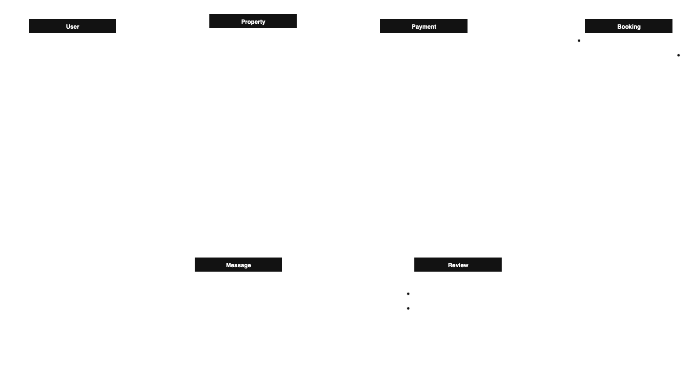

# Entity Relationships
1. User ↔ Booking

Type: One-to-Many (1:N)

Relationship: One user (guest) can create many bookings.

Optionality:

Each booking must be associated with one user (mandatory).

A user can exist without any bookings (optional).

Diagram notation:
User (1) ——< (0..*) Booking

2. Property ↔ Booking
Type: One-to-Many (1:N)

Relationship: One property can be booked multiple times.

Optionality:

Each booking must be associated with one property.

A property can exist without any bookings.

Diagram notation:
Property (1) ——< (0..*) Booking

3. User (Host) ↔ Property
Type: One-to-Many (1:N)

Relationship: One host (user with role = "host") can own multiple properties.

Optionality:

Each property must have a host.

A user may or may not host any property.

Diagram notation:
User (1) ——< (0..*) Property

4. Booking ↔ Payment
Type: One-to-One (1:1) or One-to-Many (1:N), depending on system design

Common Case: One booking → One payment

Optionality:

Each payment must be linked to a booking.

Each booking may or may not have a payment record (e.g., unpaid or canceled).

Diagram notation:
Booking (0..1) —— (1) Payment

5. User ↔ Message
Type: One-to-Many (1:N), from both sender and recipient sides

Relationship:

A user can send/receive many messages.

Diagram notation:
User (1) ——< (0..*) Message (for both sender_id and recipient_id)

6. User ↔ Review
Type: One-to-Many (1:N)

Relationship: A user can leave many reviews.

Optionality:

A review must have a user.

A user might not leave any reviews.

Diagram notation:
User (1) ——< (0..*) Review

7. Property ↔ Review
Type: One-to-Many (1:N)

Relationship: A property can have many reviews.

Optionality:

A review must be associated with a property.

A property might have no reviews yet.

Diagram notation:
Property (1) ——< (0..*) Review